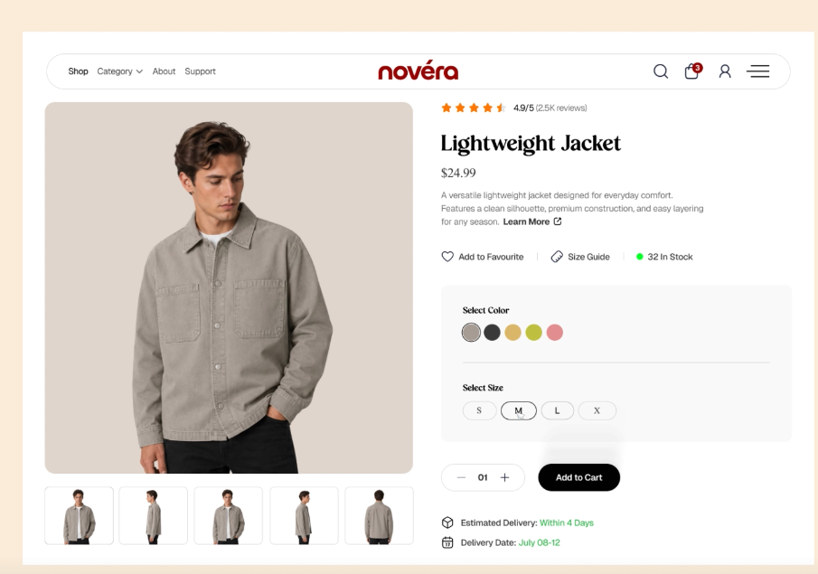
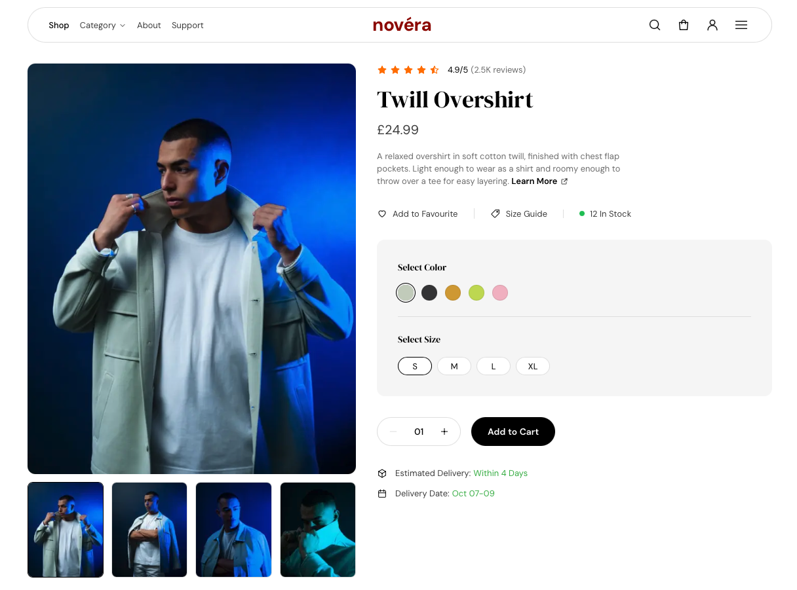
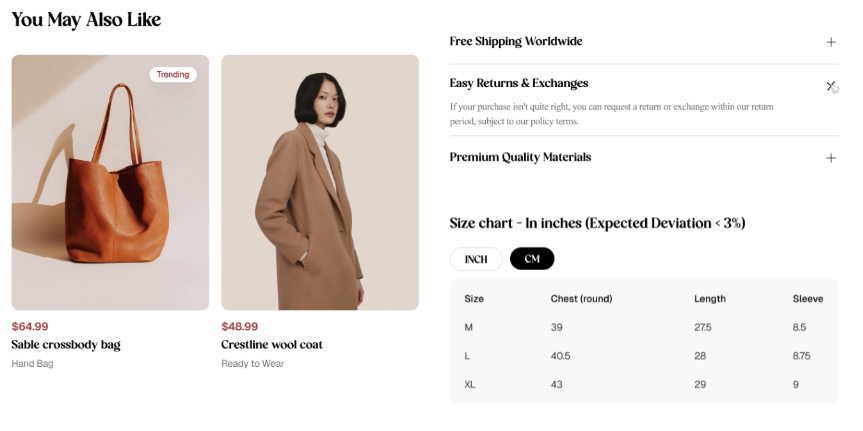
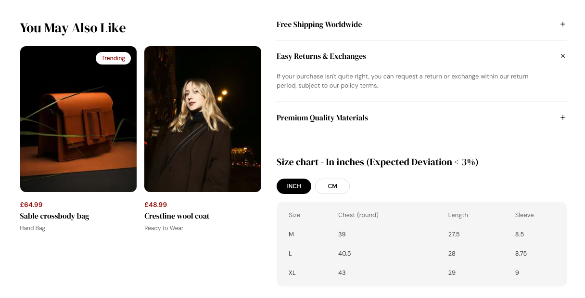

# Novera product page

Built from [Ecommerce Product Page Design](https://dribbble.com/shots/27634338-Ecommerce-Product-Page-Design) by [Designer Name] on Dribbble, used as a design brief. The design is theirs. The build, the mobile and tablet layouts, and the interaction details are mine.

**Live:** [novera-product-page.vercel.app](https://novera-product-page.vercel.app)

## Design vs build

| Dribbble concept                     | This build                                |
| ------------------------------------ | ----------------------------------------- |
|    |    |
|  |  |

## Decisions beyond the mock

The mock is a single desktop frame, so a lot of the work was deciding how it should behave.

- **Stock per variant.** Stock is tracked for every colour and size combination. The stock count, the disabled sizes and the quantity limit all follow the current selection, and switching to a colour where your size is sold out moves you to the first available size.
- **Real delivery dates.** The range is calculated in the visitor's browser as 3 to 5 working days from today, skipping weekends. The page is statically rendered, so calculating it at build time would freeze the date at the last deploy.
- **UK pricing.** Prices are in GBP using `Intl.NumberFormat`.
- **Size chart fix.** In the mock, the heading says inches while CM is selected and the values never change. Here the heading follows the toggle and centimetres are converted from the inch values.
- **XL, not X.** The mock's size label is corrected.
- **Portrait crops.** The product photography is portrait, so the gallery uses a 4:5 ratio with a focal point that keeps faces and the garment in frame.
- **Mobile layout.** The gallery becomes a swipeable carousel with scroll snap and position dots, the header collapses to icons, and the quantity and Add to Cart row stretches to the full width with 48px tap targets.
- **Sticky gallery on desktop.** Images stay in view while you read the details.
- **Motion with restraint.** The accordion animates open and closed, and the lower section rises into place with a short stagger as you scroll. All motion uses transform and opacity only and switches off for users who prefer reduced motion.

## Build notes

- **Stack:** Next.js 16 (App Router), TypeScript, SCSS. No CSS framework.
- **Styling:** strict BEM naming, one partial per component block, design tokens for every colour, size and spacing value, and mobile first media queries with `sass-mq`. Stylelint enforces the BEM pattern.
- **Accessibility:** colour and size pickers are real radio groups, the size chart is a proper table with row and column headers, the cart confirmation and delivery date are announced through live regions, focus rings show for keyboard users only, and everything works from the keyboard.
- **Progressive enhancement:** the accordion is built on native `<details>`, so it works without JavaScript, with the animation layered on top using the Web Animations API. The scroll reveal only hides content after JavaScript has loaded, so nothing is ever stuck invisible.
- **Data:** product, related products and size chart data live in JSON, and the product is also served from `/api/product`.
- **Testing:** 29 Jest and React Testing Library tests covering stock logic, the working day delivery range, unit conversion, the variant picker, the cart badge, the size chart toggle, the accordion fallback and server rendering of the delivery date.
- **CI:** GitHub Actions runs linting, style linting, tests and a production build on every push.
- **Performance:** Lighthouse mobile [score] performance, [score] accessibility.

## Run it

Requires Node.js LTS.

```bash
npm install
npm run dev
```

Then open http://localhost:3000.

| Script                | What it does                    |
| --------------------- | ------------------------------- |
| `npm run dev`         | Start the dev server            |
| `npm run build`       | Production build                |
| `npm run lint`        | ESLint                          |
| `npm run lint:styles` | Stylelint (SCSS and BEM naming) |
| `npm run format`      | Format everything with Prettier |
| `npm test`            | Run the Jest test suite         |

## Credits

- Design: [Designer Name], [Ecommerce Product Page Design](https://dribbble.com/shots/27634338-Ecommerce-Product-Page-Design)
- Photography from Pexels: [name] (overshirt), [name] (bag), [name] (coat)

## Next steps

- Swap gallery images per colour
- End to end tests with Playwright
- Connect to a headless commerce backend
